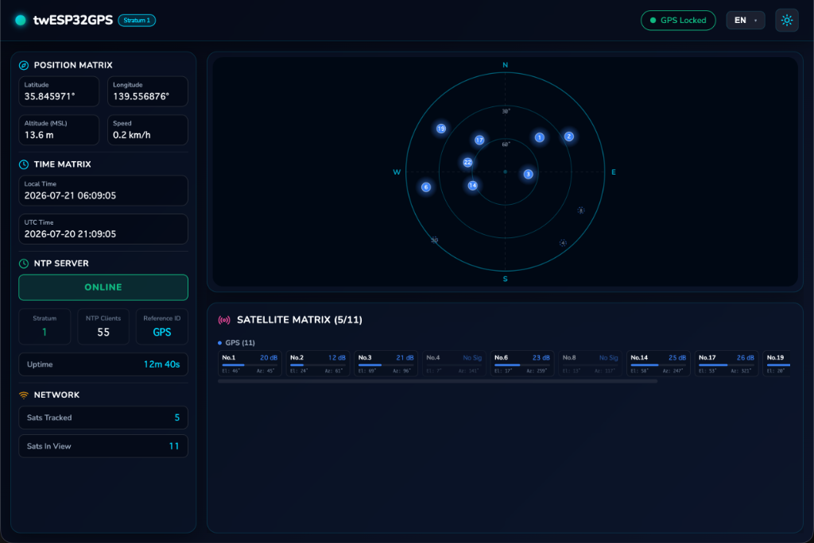
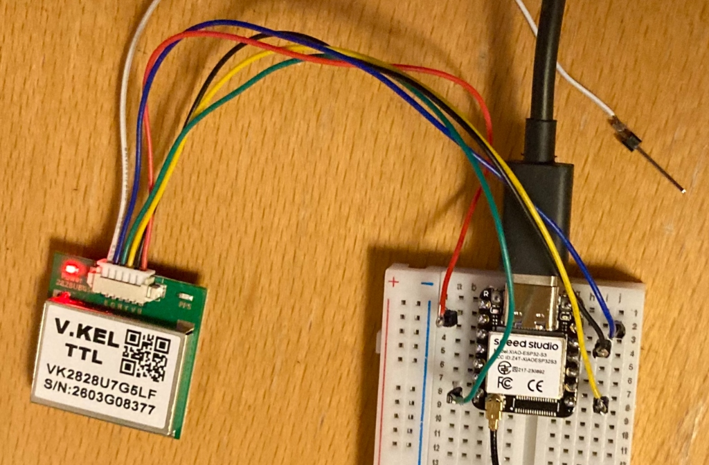

# twESP32GPS

**Stratum 1 NTP Server & Satellite Dashboard**  
for Seeed Studio XIAO ESP32-S3 + VK2828U7G5 GPS Module

[](LICENSE)
[](https://www.espressif.com/en/products/socs/esp32-s3)
[](https://arduino.github.io/arduino-cli/)

[日本語版 README はこちら](README_ja.md)

---

## Overview

**twESP32GPS** is an Arduino-based firmware for the [Seeed Studio XIAO ESP32-S3](https://wiki.seeedstudio.com/xiao_esp32s3_getting_started/) microcontroller paired with a VK2828U7G5 multi-constellation GPS module.

It turns a tiny, low-cost ESP32-S3 board into a **Stratum 1 NTP time server** that is disciplined by a 1PPS (pulse-per-second) hardware interrupt from the GPS module, achieving sub-millisecond timing accuracy. In addition to precise timekeeping, a browser-based dashboard gives you a real-time sky plot of all visible satellites across six GNSS constellations.

### Key Highlights

- **No dedicated GPS server hardware needed** — runs entirely on a compact XIAO ESP32-S3 board
- **1PPS-disciplined NTP** for high-accuracy time distribution on your LAN
- **Live satellite visualization** in your browser — no app installation required
- **Zero-config WiFi setup** via captive portal on first boot
- **Bilingual UI** (English / Japanese) switchable from the dashboard



---

## Features

| Feature | Description |
|---------|-------------|
| 🛰️ **Stratum 1 NTP Server** | GPS-disciplined, 1PPS hardware interrupt for sub-millisecond accuracy. Implements RFC 4330 / RFC 5905. |
| 🌐 **Web Dashboard** | Svelte 5 single-page app with real-time satellite Sky Plot (Canvas 2D). Served from LittleFS as gzip-compressed HTML. |
| 📡 **Multi-constellation** | Tracks GPS, GLONASS, Galileo, BeiDou, QZSS, and SBAS satellites simultaneously. |
| 🔧 **WiFiManager** | Captive Portal for easy WiFi configuration on first boot — no hardcoded credentials. |
| 🌍 **EN/JA Bilingual UI** | English and Japanese dashboard interface switchable at runtime. |
| 📊 **REST JSON API** | `GET /api/gps` endpoint returns full GPS state (fix, position, satellites, NTP stats) as JSON. |
| ⏱️ **Uptime & Client Tracking** | Tracks device uptime and total NTP client request count. |
| 💾 **LittleFS Storage** | Frontend assets stored in the ESP32 flash filesystem (LittleFS), served via HTTP. |

---

## Required Hardware

| Item | Quantity | Notes |
|------|----------|-------|
| [Seeed Studio XIAO ESP32-S3](https://wiki.seeedstudio.com/xiao_esp32s3_getting_started/) | 1 | Main microcontroller board |
| VK2828U7G5 GPS Module | 1 | Multi-constellation GNSS with 1PPS output |
| USB-C cable | 1 | For programming and power |
| Jumper wires | 6 | 6 connections (GND, VCC, TX, RX, PPS, EN) |
| Breadboard (optional) | 1 | For prototyping |

> **Power note**: The XIAO ESP32-S3 and GPS module both operate at 3.3 V. The GPS VCC and EN pins connect directly to the board's 3V3 rail.

---

## Circuit Diagram

### Wiring Table

| GPS Pin | Label | XIAO ESP32-S3 Pin | GPIO |
|---------|-------|-------------------|------|
| G | GND | GND | — |
| V | VCC | 3V3 | — |
| T | TX (GPS→ESP) | D7 | GPIO 44 |
| R | RX (ESP→GPS) | D6 | GPIO 43 |
| B | PPS | D1 | GPIO 2 |
| E | EN (Enable) | 3V3 | — |

### Wiring Diagram (ASCII)

```
VK2828U7G5 GPS Module          XIAO ESP32-S3
┌─────────────────┐            ┌──────────────────┐
│  G  (GND)  ─────┼────────────┼─ GND             │
│  V  (VCC)  ─────┼────────────┼─ 3V3             │
│  T  (TX)   ─────┼────────────┼─ D7  (GPIO 44)   │
│  R  (RX)   ─────┼────────────┼─ D6  (GPIO 43)   │
│  B  (1PPS) ─────┼────────────┼─ D1  (GPIO 2)    │
│  E  (EN)   ─────┼────────────┼─ 3V3             │
└─────────────────┘            └──────────────────┘
                                      │
                                   USB-C
                                 (to PC/power)
```

### Wiring Photo



> **1PPS Signal**: The PPS pin generates a precise pulse every second at the exact GPS second boundary. The firmware captures this pulse via a hardware interrupt (`RISING` edge on GPIO 2) to discipline the NTP timestamps.

---

## Project Structure

```
twESP32GPS/
├── mise.toml                    # Development environment (arduino-cli + node)
├── twESP32GPS/                  # Arduino sketch
│   ├── twESP32GPS.ino           # Main entry point (setup/loop)
│   ├── config.h                 # Pin definitions & constants
│   ├── gps.h / gps.cpp          # GPS parsing (TinyGPS++ + custom NMEA GSV)
│   ├── ntp.h / ntp.cpp          # NTP UDP server (RFC 5905, Stratum 1)
│   ├── web.h / web.cpp          # HTTP server + /api/gps JSON endpoint
│   ├── dashboard.h              # Embedded gzipped Svelte dashboard (auto-generated)
│   └── data/                    # LittleFS filesystem root
│       └── index.html.gz        # Svelte dashboard (built by scripts/)
├── frontend/                    # Svelte 5 + Vite frontend source
│   ├── src/
│   │   ├── App.svelte           # Main UI (3-pane layout)
│   │   ├── components/
│   │   │   └── SkyPlot.svelte   # Canvas 2D satellite sky plot
│   │   ├── i18n.svelte.js       # EN/JA translations
│   │   └── style.css            # Glassmorphic dark/light theme
│   └── vite.config.js           # Vite + gzip compression config
└── scripts/
    ├── install_libs.sh          # Install Arduino libs & board core
    ├── build_frontend.sh        # Build Svelte → gzip → dashboard.h
    ├── build_fw.sh              # Compile Arduino firmware
    ├── flash.sh                 # Flash firmware + upload LittleFS
    └── inline_and_convert.js    # Inline assets and convert to C++ header
```

---

## Prerequisites

### Software

| Tool | Version | Install |
|------|---------|---------|
| [arduino-cli](https://arduino.github.io/arduino-cli/) | latest | `brew install arduino-cli` (macOS) |
| [Node.js](https://nodejs.org/) | ≥ 20 | via [mise](https://mise.jdx.dev/) or [nvm](https://github.com/nvm-sh/nvm) |
| [mise](https://mise.jdx.dev/) | latest | `curl https://mise.run \| sh` (optional but recommended) |

### Arduino Libraries (auto-installed by `install_libs.sh`)

| Library | Version |
|---------|---------|
| [TinyGPS++](https://github.com/mikalhart/TinyGPSPlus) | latest |
| [ArduinoJson](https://arduinojson.org/) | v7.x |
| [WiFiManager](https://github.com/tzapu/WiFiManager) | latest |
| esp32:esp32 board core | ≥ 3.x |

---

## Build & Flash

### 1. Clone the Repository

```bash
git clone https://github.com/twsnmp/twESP32GPS.git
cd twESP32GPS
```

### 2. Install Dependencies

```bash
# Install mise (if not already installed)
curl https://mise.run | sh

# Install all dependencies: ESP32 board core + Arduino libs + npm packages
mise run install
```

Or without mise:

```bash
# Install Arduino libraries and board core
bash scripts/install_libs.sh

# Install frontend npm dependencies
cd frontend && npm install && cd ..
```

### 3. Build Frontend

Compile the Svelte dashboard, inline all assets, and generate `dashboard.h`:

```bash
mise run build-frontend
# or:
bash scripts/build_frontend.sh
```

### 4. Compile Firmware

```bash
mise run build
# or:
bash scripts/build_fw.sh
```

### 5. Flash to XIAO ESP32-S3

Plug in the XIAO ESP32-S3 via USB-C, then:

```bash
mise run flash
# or (auto-detect port):
bash scripts/flash.sh

# or specify port explicitly:
bash scripts/flash.sh /dev/tty.usbmodem1101   # macOS
bash scripts/flash.sh /dev/ttyACM0            # Linux
```

The flash script performs the following steps:
1. Compiles the firmware
2. Uploads the compiled binary to flash
3. Uploads the LittleFS filesystem image (containing the dashboard)

---

## Configuration

### WiFi Setup (First Boot)

On first boot (or when WiFi credentials are not saved), the device starts a **WiFi Access Point**:

| Setting | Value |
|---------|-------|
| SSID | `twESP32GPS-Setup` |
| Password | *(none — open AP)* |
| Portal URL | `http://192.168.4.1` |
| Portal timeout | 3 minutes |

**Steps:**
1. Connect your phone or laptop to the `twESP32GPS-Setup` WiFi network
2. A captive portal page should open automatically (or open `http://192.168.4.1` manually)
3. Select your home/office WiFi network and enter the password
4. The device restarts and connects to your network

After connecting, the device's IP address is printed to the serial console:

```
[WiFi] Connected! IP: 192.168.1.xxx
[Ready] NTP: 192.168.1.xxx:123 | Web: http://192.168.1.xxx/
```

### Firmware Constants (`config.h`)

You can change the following constants by editing [`twESP32GPS/config.h`](twESP32GPS/config.h) before compiling:

| Constant | Default | Description |
|----------|---------|-------------|
| `GPS_BAUD` | `9600` | GPS module baud rate |
| `GPS_RX_PIN` | `44` | GPIO for GPS TX → ESP RX (D7) |
| `GPS_TX_PIN` | `43` | GPIO for GPS RX → ESP TX (D6) |
| `PPS_PIN` | `2` | GPIO for 1PPS signal (D1) |
| `NTP_PORT` | `123` | NTP server UDP port |
| `HTTP_PORT` | `80` | HTTP web server port |
| `WIFI_AP_NAME` | `"twESP32GPS-Setup"` | Access point SSID for WiFi setup |
| `WIFI_AP_PASS` | `""` | AP password (empty = open) |
| `MAX_SATELLITES` | `48` | Maximum satellite entries to store |

### Frontend Development (Live Reload)

To develop the UI locally with live reload, proxy API calls to a real ESP32:

```bash
# Edit frontend/vite.config.js and update the proxy target to your ESP32 IP
cd frontend
npm run dev
# Open: http://localhost:5173
```

---

## Accessing the Device

Once on your network, access the device via the IP shown in the serial console:

| Service | URL / Address |
|---------|--------------|
| Web Dashboard | `http://<ESP32-IP>/` |
| GPS JSON API | `http://<ESP32-IP>/api/gps` |
| NTP Server | UDP `<ESP32-IP>:123` |

---

## API Reference

### `GET /api/gps`

Returns the current GPS state and satellite data as JSON.

**Example response:**

```json
{
  "hasFix": true,
  "time": "03:34:56",
  "date": "2025-07-19",
  "latitude": 35.681236,
  "longitude": 139.767125,
  "altitude": 40.5,
  "speedKmh": 0.2,
  "numSatellites": 8,
  "numSatsInView": 14,
  "stratum": 1,
  "uptime": 3600,
  "ntpClients": 42,
  "satellites": [
    { "prn": 1,  "system": "GPS",     "elevation": 45, "azimuth": 120, "snr": 38 },
    { "prn": 65, "system": "GLONASS", "elevation": 32, "azimuth": 210, "snr": 30 },
    { "prn": 11, "system": "Galileo", "elevation": 20, "azimuth": 310, "snr": 25 }
  ]
}
```

**Field descriptions:**

| Field | Type | Description |
|-------|------|-------------|
| `hasFix` | bool | `true` if GPS has a valid position fix |
| `time` | string | UTC time (HH:MM:SS) |
| `date` | string | UTC date (YYYY-MM-DD) |
| `latitude` | float | Latitude in decimal degrees |
| `longitude` | float | Longitude in decimal degrees |
| `altitude` | float | Altitude in meters |
| `speedKmh` | float | Speed over ground (km/h) |
| `numSatellites` | int | Satellites used in fix (from GGA) |
| `numSatsInView` | int | Total satellites in view (from GSV) |
| `stratum` | int | NTP stratum: `1` = GPS fix, `16` = no fix |
| `uptime` | int | Device uptime in seconds |
| `ntpClients` | int | Total NTP requests served since boot |
| `satellites[]` | array | Per-satellite detail (see below) |
| `satellites[].prn` | int | Satellite PRN number |
| `satellites[].system` | string | Constellation: GPS, GLONASS, Galileo, BeiDou, QZSS, SBAS |
| `satellites[].elevation` | int | Elevation angle (degrees, 0–90) |
| `satellites[].azimuth` | int | Azimuth angle (degrees, 0–359) |
| `satellites[].snr` | int | Signal-to-noise ratio (dBHz, 0 = not tracked) |

---

## Testing

### Serial Monitor

Connect the XIAO ESP32-S3 via USB and open a serial monitor at **115200 baud** to view startup messages and GPS parsing output.

### Test NTP Server

```bash
# Query NTP and check offset/stratum (macOS/Linux)
ntpdate -q <ESP32-IP>

# Detailed NTP packet inspection
ntpq -p <ESP32-IP>

# Using sntp
sntp -d <ESP32-IP>
```

**Expected output when GPS has a fix:**

```
server <ESP32-IP>, stratum 1, offset 0.000xxx, delay 0.00xxx
```

**Expected output before GPS fix (waiting for satellites):**

```
server <ESP32-IP>, stratum 16, ...
```

> **Note**: After powering on, the GPS module may take 30 seconds to several minutes to acquire a fix (Time-To-First-Fix, TTFF), depending on cached almanac/ephemeris data and sky visibility. NTP stratum will be `16` until a fix is acquired.

### Test Web Dashboard

1. Open a browser and navigate to `http://<ESP32-IP>/`
2. The dashboard should display:
   - GPS fix status, UTC time/date, coordinates, altitude, speed
   - NTP stratum and client request count
   - Sky Plot showing satellite positions and signal strengths
3. Data refreshes automatically every few seconds

### Test JSON API

```bash
curl http://<ESP32-IP>/api/gps | python3 -m json.tool
```

---

## Troubleshooting

| Symptom | Possible Cause | Solution |
|---------|---------------|----------|
| No WiFi AP on first boot | Firmware not flashed correctly | Re-run `flash.sh`; check serial output |
| GPS shows no fix | Poor sky visibility or indoors | Move to a location with a clear view of the sky |
| NTP stratum is 16 | No GPS fix yet | Wait for GPS to acquire a fix (TTFF) |
| Dashboard not loading | LittleFS not uploaded or build failed | Ensure `build_frontend.sh` and `flash.sh` both complete successfully |
| Serial port not found | USB driver not installed | Install CH340 or CP210x USB serial driver for your OS |
| WiFi setup portal times out | 3-minute timeout elapsed | Power-cycle the device and try again |

---

## Dependencies

| Type | Library/Tool | Version | License |
|------|-------------|---------|---------|
| Arduino | [TinyGPS++](https://github.com/mikalhart/TinyGPSPlus) | latest | LGPL-2.1 |
| Arduino | [ArduinoJson](https://arduinojson.org/) | v7.x | MIT |
| Arduino | [WiFiManager](https://github.com/tzapu/WiFiManager) | latest | MIT |
| ESP32 Core | [esp32:esp32](https://github.com/espressif/arduino-esp32) | ≥ 3.x | Apache-2.0 |
| Frontend | [Svelte](https://svelte.dev/) | v5.x | MIT |
| Frontend | [Vite](https://vitejs.dev/) | v6.x | MIT |
| Build Tool | [arduino-cli](https://arduino.github.io/arduino-cli/) | latest | Apache-2.0 |
| Dev Env | [mise](https://mise.jdx.dev/) | latest | MIT |

---

## License

This project is licensed under the **Apache License 2.0**.  
See the [LICENSE](LICENSE) file for the full text.

```
Copyright 2025 twsnmp contributors

Licensed under the Apache License, Version 2.0 (the "License");
you may not use this file except in compliance with the License.
You may obtain a copy of the License at

    http://www.apache.org/licenses/LICENSE-2.0
```

---

## Credits & Related Projects

- **[twgps](../twgps)** — Go-based predecessor; UI/UX design and NTP logic inspired by twgps
- NTP implementation follows [RFC 4330](https://datatracker.ietf.org/doc/html/rfc4330) / [RFC 5905](https://datatracker.ietf.org/doc/html/rfc5905)
- GPS parsing uses [TinyGPS++](https://github.com/mikalhart/TinyGPSPlus) with custom NMEA GSV multi-constellation extensions

---

## Contributing

Contributions, issues, and feature requests are welcome.  
Please open an issue or pull request on the project repository.
